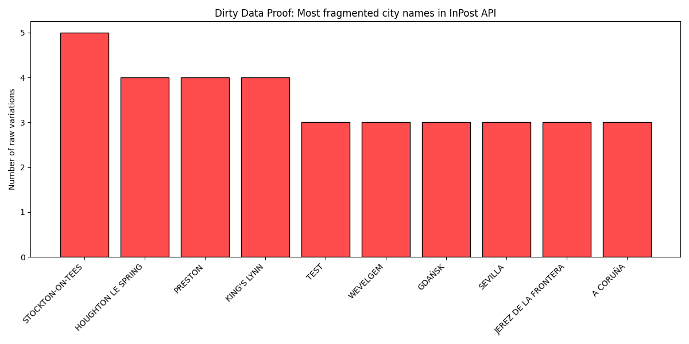

# 🚨 InPost API Data Pollution Report

> **Architectural Conclusion:** High name fragmentation makes raw `?city=` queries unreliable. Full in-memory caching and normalization is required.

## 1. Scale of the Problem
- **Cities with multiple variations:** 4237
- **Garbage lockers (TEST/DO WYKORZYSTANIA):** 704

## 2. Visual Proof

## 3. Fragmentation Examples (Top cases)
| Normalized City | Raw API Variations | Total Machines |
|:---|:---|:---|
| **STOCKTON-ON-TEES** | `Stockton-on-tees` (1), `STOCKTON-ON-TEES` (9), `Stockton-On-tees` (1), `Stockton-On-Tees` (2), `Stockton-on-Tees` (34) | 47 |
| **HOUGHTON LE SPRING** | `Houghton le spring` (1), `HOUGHTON LE SPRING` (5), `Houghton Le Spring` (7), `Houghton le Spring` (9) | 22 |
| **PRESTON** | `Preston` (104), `PRESTON` (19), `Preston ` (1), `preston` (2) | 126 |
| **KING'S LYNN** | `KING'S LYNN` (2), `King's lynn` (2), `King's Lynn` (17), `King'S Lynn` (1) | 22 |
| **TEST** | `test` (102), `TEST` (564), `Test` (10) | 676 |
| **WEVELGEM** | `WEVELGEM` (1), `wevelgem` (1), `Wevelgem` (2) | 4 |
| **GDAŃSK** | `Gdańsk` (465), `Gdańsk ` (1), `GDAŃSK` (1) | 467 |
| **SEVILLA** | `SEVILLA` (147), `sEVILLA` (1), `Sevilla` (114) | 262 |
| **JEREZ DE LA FRONTERA** | `Jerez de la Frontera` (38), `JEREZ DE LA FRONTERA` (45), `Jerez de la frontera` (1) | 84 |
| **A CORUÑA** | `A CORUÑA` (15), `A Coruña` (102), `A coruña` (1) | 118 |
