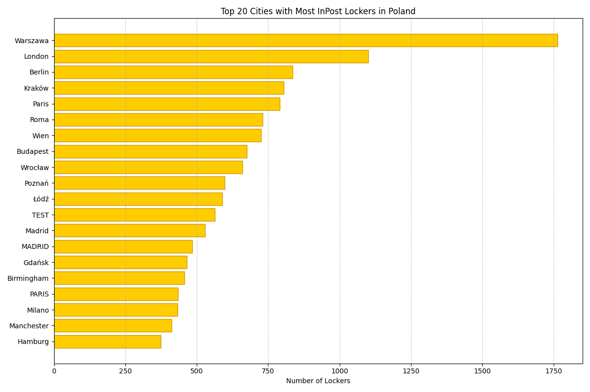

# InPost Lockers Distribution Report

## 📊 Overview
- **Total lockers in Poland:** 153061
- **Total lockers in Top 50 cities:** 20648
- **Top 50 Share:** **13.49%** of all machines

## 📈 Visual Summary (Top 20)


## 📋 Top 50 Data Table
| Rank | City | Lockers Count | Share (%) |
|:----:|:-----|:-------------:|:---------:|
| 1 | Warszawa | 1763 | 1.15% |
| 2 | London | 1100 | 0.72% |
| 3 | Berlin | 835 | 0.55% |
| 4 | Kraków | 805 | 0.53% |
| 5 | Paris | 790 | 0.52% |
| 6 | Roma | 731 | 0.48% |
| 7 | Wien | 725 | 0.47% |
| 8 | Budapest | 675 | 0.44% |
| 9 | Wrocław | 660 | 0.43% |
| 10 | Poznań | 598 | 0.39% |
| 11 | Łódź | 589 | 0.38% |
| 12 | TEST | 564 | 0.37% |
| 13 | Madrid | 529 | 0.35% |
| 14 | MADRID | 485 | 0.32% |
| 15 | Gdańsk | 465 | 0.30% |
| 16 | Birmingham | 457 | 0.30% |
| 17 | PARIS | 435 | 0.28% |
| 18 | Milano | 432 | 0.28% |
| 19 | Manchester | 412 | 0.27% |
| 20 | Hamburg | 375 | 0.25% |
| 21 | LONDON | 367 | 0.24% |
| 22 | Marseille | 362 | 0.24% |
| 23 | Szczecin | 341 | 0.22% |
| 24 | Glasgow | 325 | 0.21% |
| 25 | Barcelona | 294 | 0.19% |
| 26 | BARCELONA | 291 | 0.19% |
| 27 | Bydgoszcz | 286 | 0.19% |
| 28 | Koeln | 280 | 0.18% |
| 29 | Katowice | 279 | 0.18% |
| 30 | Lublin | 269 | 0.18% |
| 31 | Białystok | 253 | 0.17% |
| 32 | Napoli | 251 | 0.16% |
| 33 | Leeds | 249 | 0.16% |
| 34 | Nottingham | 246 | 0.16% |
| 35 | Torino | 244 | 0.16% |
| 36 | HELSINKI | 227 | 0.15% |
| 37 | Liverpool | 217 | 0.14% |
| 38 | Frankfurt am Main | 216 | 0.14% |
| 39 | Gdynia | 213 | 0.14% |
| 40 | Bristol | 209 | 0.14% |
| 41 | Sheffield | 208 | 0.14% |
| 42 | Muenchen | 197 | 0.13% |
| 43 | Toulouse | 193 | 0.13% |
| 44 | Leicester | 193 | 0.13% |
| 45 | Lyon | 181 | 0.12% |
| 46 | GÖTEBORG | 181 | 0.12% |
| 47 | Rzeszów | 168 | 0.11% |
| 48 | Częstochowa | 166 | 0.11% |
| 49 | Toruń | 159 | 0.10% |
| 50 | Gliwice | 158 | 0.10% |

## 💻 Java Integration (Spring Boot)
Copy and paste this list directly into your caching Scheduler:

```java
public static final List<String> TOP_CITIES_FOR_CACHE = List.of(
    "Warszawa", "London", "Berlin", "Kraków", "Paris", "Roma", "Wien", "Budapest", "Wrocław", "Poznań", "Łódź", "TEST", "Madrid", "MADRID", "Gdańsk", "Birmingham", "PARIS", "Milano", "Manchester", "Hamburg", "LONDON", "Marseille", "Szczecin", "Glasgow", "Barcelona", "BARCELONA", "Bydgoszcz", "Koeln", "Katowice", "Lublin", "Białystok", "Napoli", "Leeds", "Nottingham", "Torino", "HELSINKI", "Liverpool", "Frankfurt am Main", "Gdynia", "Bristol", "Sheffield", "Muenchen", "Toulouse", "Leicester", "Lyon", "GÖTEBORG", "Rzeszów", "Częstochowa", "Toruń", "Gliwice"
);
```
